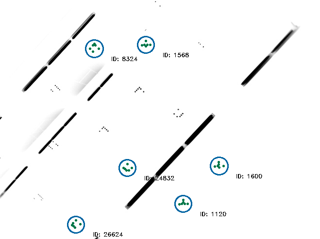

# stargazer
A landmark-based visual indoor localization system for mobile robots


## Installation
### Dependencies
You need the following dependencies to build this project:

* [yaml-cpp](https://github.com/jbeder/yaml-cpp/)
* [libceres-dev](https://ceres-solver.org/)
* [opencv](https://opencv.org/)

If you are using [rosdep](http://docs.ros.org/independent/api/rosdep/html/overview.html), which now is a stand-alone tool independent of ROS, you can simply run the following command to install these dependencies:

    rosdep install stargazer

## Build
[catkin-tools](https://catkin-tools.readthedocs.io/en/latest/) are recommended as build tools, but a classical build is possible as well:
```
mkdir build
cd build
cmake ..
make
```

## Install
Install via

    make install

## Example
A simple usage example is included and will be build with the library. It resides in `devel/lib/stargazer/` run it by handing it the path to the example file and config:

    ./devel/lib/stargazer/stargazer_demo res/frame0135.jpg res/stargazer.yaml-cpp

If you do not use catkin, the command is sligtly different:

    ./build/devel/lib/stargazer/stargazer_demo res/frame0135.jpg res/stargazer.yaml-cpp


# Documentation
The library is fully documented with Doxygen comments. Build the documentation by running

    doxygen Doxyfile
